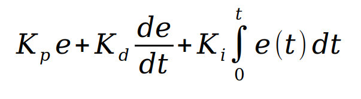

# CarND-Controls-PID
Self-Driving Car Engineer Nanodegree Program

## Project Analysis
A fairly straight-forward project, the key concept is to understand the impact of parameter tuning, and how it will affect reaction times on the car's driving. A slow reaction could yield to driving offroad on a hard turn, a fast reaction could lead to overshooting and oscillations.

## PID Parameters reflection
A (P)roportional-(I)ntegral-(D)erivative Controller is a feedback control loop. The goal is to fine tune the control values to achieve the target control value as fast as possible but also as smooth and stable as possible.

Given a target value and a measure position, we can compute the current system error. This will be the input for the PID control loop.

- The proportinal value is the brute force stepping part of the control. With each step it moves to the target value by an amount proportional to the error. In this project, steer the car to the desired lane position by reducing the measured error to 0. Since each step is a fixed factor of a value, the proportional component of the control will never exactly reach the target and always overshoot it, ending in an oscillating behaviour around the 0 error center. In turn, the further away from the target, the larger the measured error and the larger the applied correction.
- The differential value smoothens the proportional approach. By taking the difference of the last measured error with the current one, it corrects the step and reduces the overshoot.
- The integral part will counter the error propagation, reducing systematic biases.


## Parameter tuning
Parameters were iterativelly fine tuned, starting from a P: 1, I: 0, D: 0 configuration and evaluating the car's behaviour. 
The proportinal value was kept low to avoid heavy oscillations, which otherwise resulted in a resonating system, since each overshoot produced a correction path that yielded a bigger overshoot and the car eventually drove off track or crashed.
The differential value was adjusted until the car could drive over longer periods and react to the track's turns.
A small integral value was then introduced to give the system a bias correction and allow the car to complete multiple track laps.

The final values I used were 
- P = 0.2
- I = 0.1
- D = 3.0

### Side note
A lot of time was invested in fine tuning parameters, and the Workspace wasn't exactly collaborative on this, since constant switching between Standard and GPU mode was necessary to compile in one and simulate in the other one. I would strongly recommend investing a few more minutes/hours in a local development environment.

---

## Dependencies

* cmake >= 3.5
 * All OSes: [click here for installation instructions](https://cmake.org/install/)
* make >= 4.1(mac, linux), 3.81(Windows)
  * Linux: make is installed by default on most Linux distros
  * Mac: [install Xcode command line tools to get make](https://developer.apple.com/xcode/features/)
  * Windows: [Click here for installation instructions](http://gnuwin32.sourceforge.net/packages/make.htm)
* gcc/g++ >= 5.4
  * Linux: gcc / g++ is installed by default on most Linux distros
  * Mac: same deal as make - [install Xcode command line tools]((https://developer.apple.com/xcode/features/)
  * Windows: recommend using [MinGW](http://www.mingw.org/)
* [uWebSockets](https://github.com/uWebSockets/uWebSockets)
  * Run either `./install-mac.sh` or `./install-ubuntu.sh`.
  * If you install from source, checkout to commit `e94b6e1`, i.e.
    ```
    git clone https://github.com/uWebSockets/uWebSockets 
    cd uWebSockets
    git checkout e94b6e1
    ```
    Some function signatures have changed in v0.14.x. See [this PR](https://github.com/udacity/CarND-MPC-Project/pull/3) for more details.
* Simulator. You can download these from the [project intro page](https://github.com/udacity/self-driving-car-sim/releases) in the classroom.
